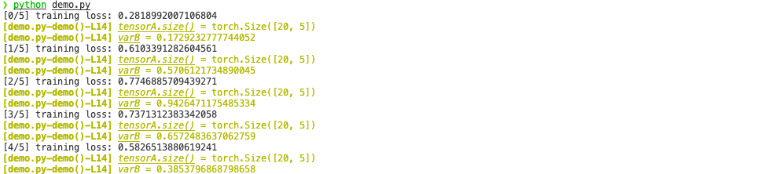

# python-dprint
debug print tool for deep learning studies in python.

# Why we need it? 
The built-in debugger is great, however, for some reason :upside_down_face:, we may still want to <b>print them out for debugging purpose</b>. For such scenarios, we would like it to have the following features (especially when running deep learning projects - where our monitoring/debugging variables are being updated within loops)

1. Context info. We may like to display the <b>invoking positions</b> for these variables (to help us identify each of them back in tons of calls), including their file name, func name, and line number. 

2. Different color. We may like it to be <b>clearly distinguishable</b> from tons of normal printings, such as <i>displaying training loss</i>. The default color is YELLOW, which you could feel free to change in [utils.py](https://github.com/chaoyivision/python-deprint/blob/main/utils.py#L10) - full color-code can be found [here](https://www.geeksforgeeks.org/print-colors-python-terminal/).

3. Multiple variables. We may <u>not</u> like to leave too much print() statement in our code - they look redundent - instead, we may like to display multiple variable within lines as less as possible (by passing them all as a dict).

# How we use it?
Very easy :innocent:.
- [utils.py](https://github.com/chaoyivision/python-deprint/blob/main/utils.py#L10): copy it (or its content) into your own projects.
- [demo.py](https://github.com/chaoyivision/python-deprint/blob/main/demo.py): see how to import and use it.

